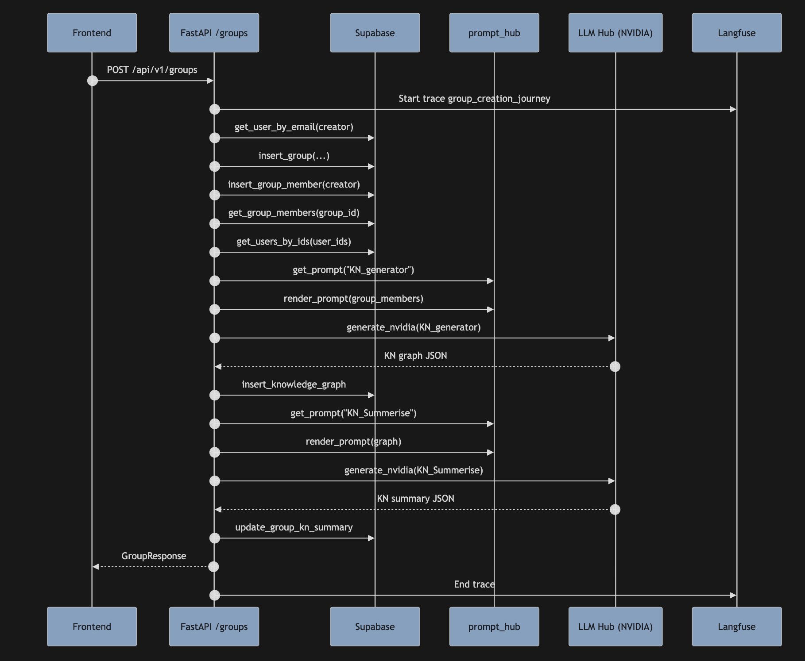

# Trip Planner Backend
# Application Link : - https://group-quest.vercel.app/
Front end repo : - https://github.com/Anky597/trip_planner_frontend
FastAPI-based async backend for collaborative AI trip planning with multi-API key support for rate limit redundancy, comprehensive LLM integration, and full observability.

## 📋 Table of Contents

- [Overview](#overview)
- [Architecture](#architecture)
- [System Flow Diagrams](#system-flow-diagrams)
- [Setup](#setup)
- [Configuration](#configuration)
- [API Endpoints](#api-endpoints)
- [Code Structure](#code-structure)
- [LLM Integration](#llm-integration)
- [Database Schema](#database-schema)
- [Testing](#testing)
- [Deployment](#deployment)

## 🎯 Overview

The Trip Planner Backend is a sophisticated FastAPI application that orchestrates AI-powered trip planning workflows. It integrates multiple LLM providers (OpenAI, Google GenAI, NVIDIA), manages user personas through knowledge graphs, generates personalized recommendations, and creates detailed trip itineraries.

### Key Features

- **Multi-LLM Support**: OpenAI, Google GenAI, and NVIDIA API integration with automatic load balancing
- **Knowledge Graph Generation**: AI-powered group personality analysis and aggregation
- **Intelligent Recommendations**: City-specific and wide-range destination suggestions
- **Plan Generation**: Multi-option trip itineraries with day-wise schedules
- **Full Observability**: Langfuse tracing for all LLM calls and business logic
- **Async Architecture**: Non-blocking operations for concurrent processing
- **Rate Limit Handling**: Multiple API keys per provider for redundancy

## 🏗️ Architecture

### System Architecture Diagram



The backend follows a layered architecture:

```
┌─────────────────────────────────────────────────────────────┐
│                        Frontend (Client)                     │
│  - Next.js Application                                       │
│  - Zustand State Management                                  │
└──────────────────────┬──────────────────────────────────────┘
                       │ HTTP/REST API
┌──────────────────────▼──────────────────────────────────────┐
│                    FastAPI Application                       │
│  ┌──────────────────────────────────────────────────────┐   │
│  │              API Layer (REST Endpoints)              │   │
│  │  - Users API    - Groups API                          │   │
│  │  - Recommendations API  - Plans API                  │   │
│  └──────────┬───────────────────────┬────────────────────┘   │
│             │                       │                        │
│  ┌──────────▼──────────┐  ┌─────────▼──────────┐           │
│  │   Services Layer    │  │      Hubs          │           │
│  │  - supabase         │  │  - prompt_hub      │           │
│  │  - knowledge        │  │  - llm_hub         │           │
│  │  - recommend        │  └─────────┬──────────┘           │
│  │  - plan             │            │                        │
│  └─────────────────────┘            │                        │
└──────────────────────────────────────┼──────────────────────┘
                                       │
        ┌──────────────────────────────┼──────────────────────┐
        │                              │                        │
┌───────▼────────┐  ┌──────────▼──────────┐  ┌───────▼────────┐
│   Supabase     │  │   Langfuse          │  │  LLM Providers │
│   (Database)   │  │   (Observability)   │  │  - OpenAI       │
│                │  │                     │  │  - Google GenAI  │
│                │  │                     │  │  - NVIDIA API   │
└────────────────┘  └─────────────────────┘  └────────────────┘
```

### Component Responsibilities

**API Layer** (`app/api/`):
- Handles HTTP requests/responses
- Validates input using Pydantic schemas
- Orchestrates business logic through services
- Manages Langfuse tracing for request journeys

**Services Layer** (`app/services/`):
- **supabase**: Database operations (CRUD for users, groups, plans, knowledge graphs)
- **knowledge**: Knowledge graph generation and summarization using NVIDIA LLM
- **recommend**: City and wide-range recommendation generation using Google GenAI
- **plan**: Trip plan generation using Google GenAI with grounding

**Hubs**:
- **prompt_hub**: Centralized prompt management via Langfuse, Jinja2 templating
- **llm_hub**: Unified interface for OpenAI, NVIDIA, and Google GenAI with automatic key rotation

## 🔄 System Flow Diagrams

### Group Creation Journey


**Sequence**: Frontend → FastAPI `/groups` → Supabase → prompt_hub → NVIDIA LLM → Supabase → Frontend

**Detailed Steps**:
1. Frontend sends `POST /api/v1/groups` with group name, destination, creator email
2. FastAPI validates creator exists in Supabase
3. Creates group record and adds creator as member
4. Retrieves all group members' persona data
5. Generates knowledge graph via NVIDIA LLM:
   - Fetches `KN_generator` prompt from Langfuse
   - Renders prompt with member personas
   - Calls NVIDIA API to generate knowledge graph JSON
6. Stores knowledge graph in Supabase
7. Summarizes knowledge graph:
   - Fetches `KN_Summerise` prompt
   - Renders with graph JSON
   - Calls NVIDIA API for summary
8. Updates group with `ai_group_kn_summary`
9. Returns `GroupResponse` to frontend

**Key Operations**:
- `get_user_by_email()` - Verify creator
- `insert_group()` - Create group
- `insert_group_member()` - Add creator
- `get_group_members()` - Fetch members
- `get_users_by_ids()` - Get member personas
- `generate_kn()` - Knowledge graph generation (NVIDIA)
- `insert_knowledge_graph()` - Store graph
- `generate_kn_summary()` - Summarize graph (NVIDIA)
- `update_group_kn_summary()` - Update group

### Recommendations Generation Flow


**Sequence**: Frontend → FastAPI `/recommendations` → Supabase → services.recommend → prompt_hub → Google GenAI → Frontend

**Detailed Steps**:
1. Frontend sends `GET /api/v1/groups/{id}/recommendations`
2. FastAPI validates group exists and has `ai_group_kn_summary`
3. Calls `generate_recommendations(kn_summary, destination)`
4. **City Recommendations (Short Trip)**:
   - Fetches `spot_finder` prompt from Langfuse
   - Renders with group summary and city parameters (1-day trip)
   - Calls Google GenAI with grounding (web search)
   - Returns city-specific recommendations JSON
5. **Wide-Range Recommendations (Long Trip)**:
   - Fetches `Serach_retrival` prompt
   - Renders with group summary and wide parameters (3-day, 100-200km radius)
   - Calls Google GenAI with grounding
   - Returns wide-range recommendations JSON
6. Returns `{short_trip, long_trip}` response

**Fallback Behavior**:
- If LLM calls fail (free tier limits), returns dummy data structure
- Ensures frontend flow continues uninterrupted for MVP demos

**Key Operations**:
- `get_group()` - Validate group
- `get_prompt("spot_finder")` - City prompt
- `get_prompt("Serach_retrival")` - Wide prompt
- `render_prompt()` - Jinja2 template rendering
- `generate_google()` - Google GenAI with web search grounding

## 🚀 Setup

### Prerequisites

- Python 3.10+ (tested with 3.13)
- pip package manager
- Supabase account and project
- API keys for LLM providers (OpenAI, Google GenAI, NVIDIA)
- Langfuse account (optional but recommended)

### Installation

1. **Clone and navigate to backend directory**:
```bash
cd trip_planner_bckend
```

2. **Create virtual environment**:
```bash
python3 -m venv myenv
source myenv/bin/activate  # On Windows: myenv\Scripts\activate
```

3. **Install dependencies**:
```bash
# Option 1: Use installation script (recommended)
./install_deps.sh

# Option 2: Install directly
pip install -r requirements.txt

# Option 3: Install in stages (if conflicts occur)
pip install fastapi==0.104.1 uvicorn[standard]==0.24.0 pydantic==2.12.4
pip install openai langfuse==3.00.0 jinja2==3.1.2
pip install websockets>=13.0,<15.0 google-genai openinference-instrumentation-google-genai==0.1.0
pip install supabase==2.24.0 supabase-auth==2.24.0 python-dotenv
```

4. **Create `.env` file** in the backend root directory:
```bash
cp .env.example .env  # If example exists, or create manually
```

5. **Configure environment variables** (see [Configuration](#configuration))

6. **Run the application**:
```bash
# Option 1: Using uvicorn command
uvicorn app.main:app --host 0.0.0.0 --port 7878 --reload

# Option 2: Using Python directly
python app/main.py
```

The server will run on `http://localhost:7878` with CORS allowing all origins.

## ⚙️ Configuration

### Environment Variables

Create a `.env` file in the backend root with the following variables:

```bash
# Application
DEBUG=False

# Supabase Database
SUPABASE_URL=https://your-project.supabase.co
SUPABASE_ANON_KEY=your-anon-key-here
SUPABASE_SERVICE_ROLE_KEY=your-service-role-key-here

# OpenAI Configuration
OPENAI_API_KEYS=key1,key2,key3  # Comma-separated for load balancing
OPENAI_BASE_URL=https://api.openai.com/v1

# NVIDIA API Configuration
NVIDIA_API_KEYS=key1,key2,key3  # Comma-separated for load balancing
NVIDIA_BASE_URL=https://integrate.api.nvidia.com/v1

# Google GenAI Configuration
GOOGLE_API_KEYS=key1,key2,key3  # Comma-separated for load balancing

# Langfuse Observability (Optional but recommended)
LANGFUSE_PUBLIC_KEY=pk-lf-your-public-key
LANGFUSE_SECRET_KEY=sk-lf-your-secret-key
LANGFUSE_BASE_URL=https://cloud.langfuse.com
```

### Multi-API Key Support

The system supports multiple API keys per LLM provider for:
- **Rate Limit Distribution**: Random key selection distributes load
- **Redundancy**: Automatic failover if one key is exhausted
- **Scalability**: Handle higher request volumes

Keys are selected randomly on each LLM call via `settings.openai_api_key`, `settings.nvidia_api_key`, and `settings.google_api_key` properties.

### Configuration Loading

Configuration is loaded via `app/core/config.py`:
- Uses `python-dotenv` to load `.env` file
- Provides `Settings` class with typed properties
- Random key selection for load balancing
- Default values for optional configurations

## 📡 API Endpoints

### Base URL
All endpoints are prefixed with `/api/v1`

### Users API

#### `POST /users`
Create a new user profile with AI-generated personality traits.

**Request Body**:
```json
{
  "email": "user@example.com",
  "name": "John Doe",
  "user_answer": {
    "Q1": "a",
    "Q2": "b",
    ...
  }
}
```

**Response**: `UserResponse`
```json
{
  "id": "uuid",
  "email": "user@example.com",
  "name": "John Doe",
  "persona_traits": {
    "traits": {...},
    "score": {...}
  },
  "ai_summary": "Personality summary text"
}
```

**Process**:
1. Validates user doesn't exist
2. Fetches `user_intrest` prompt from Langfuse
3. Renders prompt with survey answers
4. Calls OpenAI to generate personality traits
5. Stores user in Supabase
6. Traces entire journey in Langfuse

#### `GET /users/info?email={email}`
Get complete user information including groups and plans.

**Query Parameters**:
- `email` (required): User email address

**Response**: `UserInfoResponse`
```json
{
  "user": {
    "id": "uuid",
    "email": "user@example.com",
    "name": "John Doe",
    "persona_traits": {...},
    "ai_summary": "..."
  },
  "groups": [
    {
      "id": "uuid",
      "name": "Group Name",
      "destination": "Destination",
      "creator_id": "uuid",
      "members": [...],
      "plans": [...]
    }
  ]
}
```

### Groups API

#### `POST /groups`
Create a new trip group and automatically generate knowledge graph.

**Request Body**:
```json
{
  "group_name": "Summer Vacation",
  "destination": "Goa",
  "creator_email": "creator@example.com"
}
```

**Response**: `GroupResponse`
```json
{
  "id": "uuid",
  "name": "Summer Vacation",
  "creator_id": "uuid",
  "destination": "Goa"
}
```

**Process** (see [Group Creation Journey](#group-creation-journey)):
- Creates group
- Adds creator as member
- Generates knowledge graph from member personas
- Summarizes knowledge graph
- Updates group with summary

#### `POST /groups/{group_id}/members`
Add a member to an existing group and refresh knowledge graph.

**Request Body**:
```json
{
  "user_email": "member@example.com"
}
```

**Response**: `MemberResponse`
```json
{
  "group_id": "uuid",
  "user_id": "uuid",
  "role": "member"
}
```

**Process**:
- Validates user exists
- Checks user not already in group
- Adds member
- Regenerates knowledge graph with updated member set
- Updates group summary

#### `GET /groups/{group_id}/traits`
Get group member traits and personality summaries.

**Response**: `GroupTraitsResponse`
```json
{
  "group_id": "uuid",
  "group_name": "Group Name",
  "group_members": [
    {
      "persona_traits": {...},
      "ai_summary": "..."
    }
  ]
}
```

#### `POST /groups/{group_id}/process`
Manually trigger knowledge graph regeneration for a group.

**Response**:
```json
{
  "message": "Processing completed"
}
```

### Recommendations API

#### `GET /groups/{group_id}/recommendations`
Generate city-specific and wide-range trip recommendations.

**Response**: `RecommendationsResponse`
```json
{
  "short_trip": {
    "user_id": "...",
    "base_city": "...",
    "short_trip_destinations": [...]
  },
  "long_trip": {
    "user_id": "...",
    "base_city": "...",
    "search_radius_km": 200,
    "short_trip_destinations": [...]
  }
}
```

**Process** (see [Recommendations Flow](#recommendations-generation-flow)):
- Validates group has `ai_group_kn_summary`
- Generates city recommendations (1-day, local)
- Generates wide recommendations (3-day, 100-200km radius)
- Uses Google GenAI with web search grounding
- Returns combined response

**Fallback**: Returns dummy data structure if LLM calls fail (MVP mode)

### Plans API

#### `POST /groups/{group_id}/plan`
Generate detailed trip plan with multiple options.

**Request Body**:
```json
{
  "raw_data": {
    "short_trip": {...},
    "long_trip": {...}
  }
}
```

**Response**: `PlanResponse`
```json
{
  "id": "uuid",
  "group_id": "uuid",
  "plan_json": {
    "plan_options": [
      {
        "plan_id": "...",
        "plan_type": "in_city",
        "plan_variant": "...",
        "schedule": [...],
        "why_fit_user": "...",
        "cost_estimates": {...},
        "sources": [...]
      }
    ]
  },
  "summary_caption": "Generated multi-option plan",
  "estimated_cost_per_person": null
}
```

**Process**:
- Validates group has `ai_group_kn_summary`
- Fetches `base_level_planner` prompt
- Renders with group summary and recommendation data
- Calls Google GenAI to generate plan options
- Stores plan in Supabase
- Returns plan with multiple itinerary options

#### `POST /plans/by-group-name`
Generate plan by group name instead of ID (utility endpoint).

**Request Body**:
```json
{
  "group_name": "Group Name",
  "raw_data": {
    "short_trip": {...},
    "long_trip": {...}
  }
}
```

**Response**: Same as `POST /groups/{group_id}/plan`

## 📁 Code Structure

```
trip_planner_bckend/
├── app/
│   ├── __init__.py
│   ├── main.py                 # FastAPI app initialization, CORS, routing
│   ├── prompt_hub.py           # Langfuse prompt management, Jinja2 rendering
│   ├── llm_hub.py              # Unified LLM interface (OpenAI, NVIDIA, Google)
│   │
│   ├── api/                    # REST API endpoints
│   │   ├── __init__.py
│   │   ├── users.py            # User creation, user info retrieval
│   │   ├── groups.py           # Group CRUD, member management, traits
│   │   ├── recommendations.py # Recommendation generation
│   │   └── plans.py            # Plan generation (by ID and by name)
│   │
│   ├── services/               # Business logic layer
│   │   ├── __init__.py
│   │   ├── supabase.py         # Database operations (users, groups, plans, KG)
│   │   ├── knowledge.py        # Knowledge graph generation & summarization
│   │   ├── recommend.py        # Recommendation generation logic
│   │   └── plan.py             # Plan generation logic
│   │
│   ├── models/                 # Pydantic schemas
│   │   ├── __init__.py
│   │   └── schemas.py          # Request/Response models, data validation
│   │
│   ├── core/                   # Core configuration
│   │   ├── __init__.py
│   │   ├── config.py           # Settings, environment variables, key management
│   │   └── logging.py          # Logging configuration
│   │
│   └── jobs/                   # Background job processing
│       ├── __init__.py
│       └── process_group.py    # Async group processing, KN refresh
│
├── requirements.txt            # Python dependencies
├── install_deps.sh             # Dependency installation script
├── Dockerfile                  # Container configuration
├── README.md                   # This file
├── test_end_to_end.py         # End-to-end API tests
├── test_config.py             # Configuration tests
└── run_tests.sh               # Test execution script
```

### Key Files Explained

**`app/main.py`**:
- FastAPI application factory
- CORS middleware configuration
- Router registration
- Lifespan management for Langfuse initialization

**`app/prompt_hub.py`**:
- Langfuse client initialization
- `get_prompt(label)`: Fetches prompts from Langfuse by label
- `render_prompt(template, **kwargs)`: Jinja2 template rendering

**`app/llm_hub.py`**:
- `generate_openai()`: OpenAI API calls with JSON parsing
- `generate_nvidia()`: NVIDIA API calls
- `generate_google()`: Google GenAI with web search grounding
- `clean_llm_json()`: Extracts JSON from markdown code fences

**`app/services/supabase.py`**:
- Synchronous Supabase client operations
- User CRUD: `get_user_by_email()`, `insert_user()`, `get_user_by_id()`
- Group CRUD: `get_group()`, `insert_group()`, `get_group_by_name()`
- Member operations: `get_group_members()`, `insert_group_member()`
- Knowledge graph: `insert_knowledge_graph()`, `update_group_kn_summary()`
- Plans: `insert_trip_plan()`, `get_group_plans()`

**`app/services/knowledge.py`**:
- `generate_kn()`: Creates knowledge graph from member personas (NVIDIA)
- `generate_kn_summary()`: Summarizes knowledge graph (NVIDIA)
- Both use Langfuse `@observe` decorator for tracing

**`app/services/recommend.py`**:
- `generate_recommendations()`: Async function generating both city and wide recommendations
- Uses Google GenAI with different parameters for each type
- Traced with Langfuse spans

**`app/services/plan.py`**:
- `generate_plan()`: Creates detailed trip plans (Google GenAI)
- Combines group summary with recommendation data
- Returns multi-option plan structure

## 🤖 LLM Integration

### Provider Support

The backend integrates three LLM providers, each optimized for specific use cases:

#### OpenAI
- **Use Case**: User personality trait generation
- **Model**: Configurable via Langfuse prompt config
- **Features**: JSON-only responses, structured output
- **Location**: `app/llm_hub.generate_openai()`

#### NVIDIA API
- **Use Case**: Knowledge graph generation and summarization
- **Model**: Configurable via Langfuse prompt config
- **Features**: High-performance inference, cost-effective
- **Location**: `app/llm_hub.generate_nvidia()`

#### Google GenAI
- **Use Case**: Recommendations and plan generation
- **Model**: `gemini-2.5-pro` (default, configurable)
- **Features**: Web search grounding, citation support, real-time data
- **Location**: `app/llm_hub.generate_google()`

### Prompt Management

Prompts are managed centrally via Langfuse:

**Stored Prompts**:
- `user_intrest`: User personality analysis (OpenAI)
- `KN_generator`: Knowledge graph generation (NVIDIA)
- `KN_Summerise`: Knowledge graph summarization (NVIDIA)
- `spot_finder`: City recommendations (Google GenAI)
- `Serach_retrival`: Wide-range recommendations (Google GenAI)
- `base_level_planner`: Trip plan generation (Google GenAI)

**Prompt Configuration**:
Each prompt in Langfuse includes:
- Template text (Jinja2 syntax)
- Model name
- Temperature
- Other LLM parameters

**Rendering**:
- Jinja2 templates with variable substitution
- Dynamic context injection (user data, group data, etc.)
- Type-safe parameter passing

### LLM Call Flow

```
API Endpoint
    ↓
Service Layer (knowledge/recommend/plan)
    ↓
prompt_hub.get_prompt(label)
    ↓
prompt_hub.render_prompt(template, context)
    ↓
llm_hub.generate_{provider}(rendered_prompt, model, params)
    ↓
LLM Provider API
    ↓
Response Parsing (JSON extraction)
    ↓
Return to Service
    ↓
Store in Database / Return to API
```

## 🗄️ Database Schema

### Supabase Tables

#### `users`
```sql
id: uuid (primary key)
email: text (unique)
name: text
persona_traits: jsonb
ai_summary: text
created_at: timestamp
updated_at: timestamp
```

#### `groups`
```sql
id: uuid (primary key)
name: text
creator_id: uuid (foreign key -> users.id)
destination: text
ai_group_kn_summary: jsonb  # Can be dict/array/string
created_at: timestamp
```

#### `group_members`
```sql
group_id: uuid (foreign key -> groups.id)
user_id: uuid (foreign key -> users.id)
role: text (default: "member" or "creator")
joined_at: timestamp
```

#### `knowledge_graphs`
```sql
id: uuid (primary key)
group_id: uuid (foreign key -> groups.id)
graph_json: jsonb
updated_at: timestamp
```

#### `trip_plans`
```sql
id: uuid (primary key)
group_id: uuid (foreign key -> groups.id)
plan_json: jsonb
summary_caption: text
estimated_cost_per_person: numeric
created_at: timestamp
```

### Relationships

```
users (1) ──< (many) group_members (many) >── (1) groups
groups (1) ──< (many) knowledge_graphs
groups (1) ──< (many) trip_plans
```

## 🧪 Testing

### Test Structure

The backend includes comprehensive testing:

**Unit Tests** (`test_config.py`):
- Configuration loading
- Environment variable parsing
- Key selection logic

**End-to-End Tests** (`test_end_to_end.py`):
- Complete user journey
- Group creation flow
- Member addition
- Recommendations generation
- Plan creation

**Integration Tests**:
- API endpoint validation
- Database operations
- LLM integration (with mocks)

### Running Tests

```bash
# Run unit tests only (no server required)
python test_config.py

# Run full test suite (installs deps, starts server, runs all tests)
./run_tests.sh

# Run end-to-end tests only (requires running server)
python test_end_to_end.py
```

### Test Coverage

- **Configuration**: Settings class, environment loading
- **API Endpoints**: All CRUD operations, error handling
- **Services**: Knowledge graph, recommendations, plans
- **Database**: Supabase operations, data integrity
- **LLM Integration**: Response parsing, error handling

## 🚢 Deployment

### Docker Deployment

```bash
# Build image
docker build -t trip-planner-backend .

# Run container
docker run -p 7878:7878 \
  -e SUPABASE_URL=... \
  -e SUPABASE_ANON_KEY=... \
  -e OPENAI_API_KEYS=... \
  -e NVIDIA_API_KEYS=... \
  -e GOOGLE_API_KEYS=... \
  trip-planner-backend
```

### Environment Variables in Production

Ensure all required environment variables are set:
- Supabase credentials
- LLM API keys (multiple keys recommended)
- Langfuse credentials (for observability)

### Production Considerations

1. **Rate Limiting**: Implement rate limiting middleware
2. **Error Handling**: Add comprehensive error logging
3. **Monitoring**: Use Langfuse for LLM call monitoring
4. **Database**: Configure Supabase connection pooling
5. **Scaling**: Use async workers for long-running LLM calls
6. **Security**: Validate API keys, implement authentication

## 📊 Observability

### Langfuse Integration

All LLM operations are traced in Langfuse:

**Traced Operations**:
- `user_signup_journey`: Complete user creation flow
- `group_creation_journey`: Group creation and KN generation
- `group_member_add_journey`: Member addition flow
- `recommendation_plan_journey`: Recommendation generation
- `plan_generation_journey`: Plan creation
- `knowledge_generation_llm_call`: KN graph generation
- `knowledge_summary_llm_call`: KN summarization
- `city_recommendations_llm_call`: City recommendations
- `wide_recommendations_llm_call`: Wide recommendations
- `plan_generation_llm_call`: Plan generation

**Trace Metadata**:
- User IDs
- Group IDs
- Request timestamps
- LLM model used
- Prompt versions
- Response times

## 🔧 Troubleshooting

### Common Issues

**Connection Reset Errors**:
- Check Supabase URL and keys
- Verify network connectivity
- Check firewall settings

**LLM API Failures**:
- Verify API keys are valid
- Check rate limits
- Review Langfuse traces for errors
- Fallback dummy data is returned for recommendations

**Knowledge Graph Errors**:
- Ensure group has members
- Verify member personas exist
- Check NVIDIA API key validity

**Pydantic Validation Errors**:
- Review schema definitions in `app/models/schemas.py`
- Check data types in database
- Verify API request payloads

## 📝 License

[Add your license here]

## 🤝 Contributing

[Add contribution guidelines here]

## 📞 Support

[Add support contact information here]
